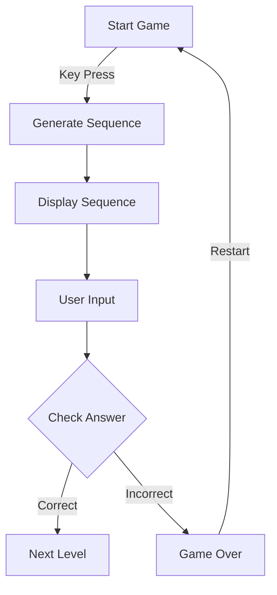
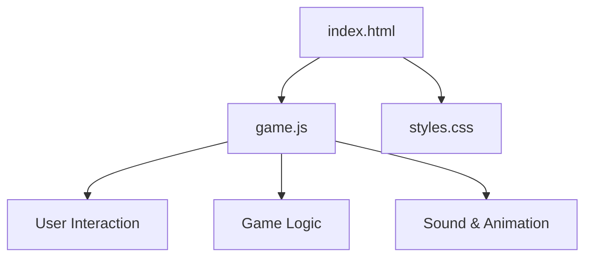
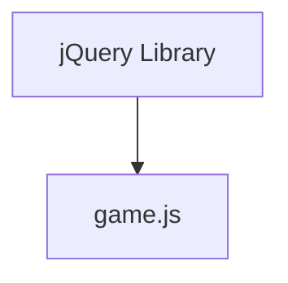

# Simon Game Documentation

## 🎯 Project Purpose

The Simon Game is a simple web-based implementation of the classic memory game "Simon." The purpose of this project is to provide an engaging and interactive way for users to test and improve their memory skills by repeating a sequence of colors generated by the game. The game challenges players to remember and replicate increasingly complex sequences, thus enhancing their cognitive abilities.

## 🧩 Module-Level Summaries

### game.js

- **Purpose**: This JavaScript file contains the core logic for the Simon Game. It handles user interactions, game sequence generation, and game state management.
- **Key Functions**:
  - `nextSequence()`: Generates the next color in the sequence and updates the game state.
  - `playSound(name)`: Plays the corresponding sound for a given color.
  - `animatePress(currentColour)`: Animates the button press effect for a given color.
  - `checkAnswer(currentLevel)`: Checks if the user's input matches the game sequence.
  - `startOver()`: Resets the game state to start over.

### index.html

- **Purpose**: This HTML file sets up the structure of the web page, including the game interface and linking necessary styles and scripts.
- **Key Elements**:
  - `<h1 id="level-title">`: Displays the current level and game status.
  - `
`: Contains the color buttons for user interaction.

### styles.css

- **Purpose**: This CSS file defines the visual styling of the game interface, including layout, colors, and animations.
- **Key Styles**:
  - `.btn`: Styles for the color buttons.
  - `.game-over`: Styles applied when the game is over.
  - `.pressed`: Styles for the button press animation.

## 🧠 Code Logic and Workflows

1. **Game Initialization**: The game starts when a key is pressed, triggering the `nextSequence()` function to generate the first color in the sequence.
2. **User Interaction**: Users click on the color buttons, which triggers event listeners to capture the input, play sounds, and animate button presses.
3. **Sequence Generation**: Each level, a new color is added to the sequence using `nextSequence()`, and the sequence is displayed to the user.
4. **Answer Checking**: User inputs are checked against the game sequence using `checkAnswer()`. If correct, the game progresses to the next level; if incorrect, the game ends and restarts.
5. **Game Over**: If the user makes a mistake, the game displays a "Game Over" message, plays a sound, and resets the game state.

## 📊 Workflow Diagrams

### Game Flow

## 🗂️ Architecture Diagram

## 🧬 Service/API Dependency Diagrams

The project uses jQuery for DOM manipulation and event handling.

## 🛠️ Database ER Diagrams

No database or ORM is used in this project.

## 💡 Best Practices & Improvement Suggestions

1. **Code Organization**: Consider modularizing the code further by separating concerns into different files or modules, such as separating sound and animation functions.
2. **Accessibility**: Improve accessibility by adding ARIA roles and ensuring the game is navigable via keyboard for users with disabilities.
3. **Scalability**: Implement a scoring system to provide additional motivation and track user progress over time.
4. **Testing**: Add unit tests to ensure the game logic functions correctly and to facilitate future development.
5. **Performance**: Optimize animations and sound loading for better performance on slower devices.